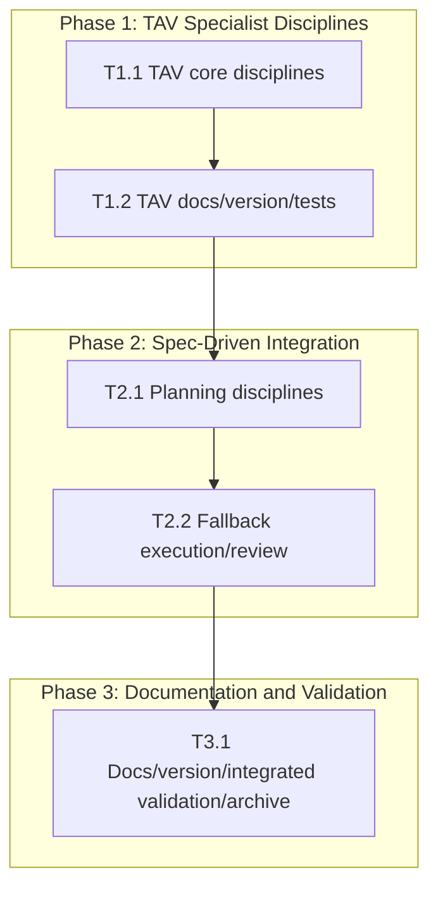

# Task Dependency Graph

```mermaid
graph TD
    subgraph P1[Phase 1: TAV Specialist Disciplines]
        T11[T1.1 TAV core disciplines] --> T12[T1.2 TAV docs/version/tests]
    end
    subgraph P2[Phase 2: Spec-Driven Integration]
        T21[T2.1 Planning disciplines] --> T22[T2.2 Fallback execution/review]
    end
    subgraph P3[Phase 3: Documentation and Validation]
        T31[T3.1 Docs/version/integrated validation/archive]
    end
    T12 --> T21
    T22 --> T31
```

The critical path is linear. Parallel lanes are intentionally disabled because the same workflow contracts and validation fingerprints are shared across tasks.
